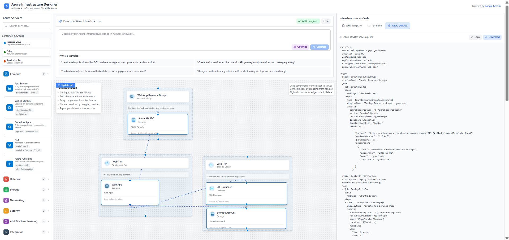
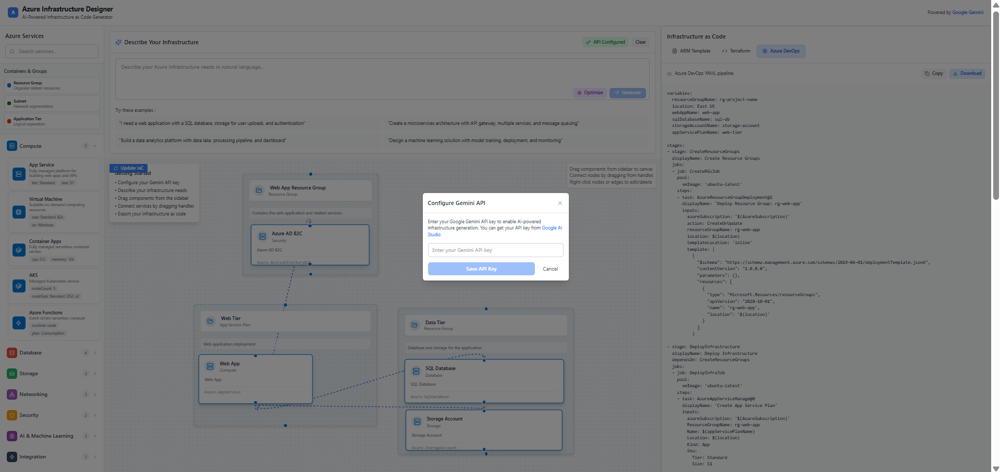

# Azure Infras## 📸 Product Snapshot

### Main Application Interface

*The main designer interface showing the drag-and-drop canvas with Azure service components, natural language input, and real-time infrastructure visualization.*

### API Configuration

*API configuration modal for setting up Google Gemini AI integration to enable intelligent infrastructure generation from natural language prompts.*

### Interactive Demo

*Live demonstration of the drag-and-drop functionality, AI-powered infrastructure generation, and real-time canvas interactions in action.*Designer

A GenAI-powered web application that enables users to architect, design, and implement Azure infrastructure services through a drag-and-drop interface. The application processes natural language prompts to generate infrastructure blueprints, which users can then customize and export as deployment templates.

## 🌟 Features

- **AI-Powered Natural Language Processing**: Describe your infrastructure needs in plain English using Google Gemini AI
- **Interactive Drag-and-Drop Interface**: Enhanced React Flow canvas with real Azure service icons
- **Real Azure Service Components**: Comprehensive library with authentic Azure service representations
- **Multi-Format Code Generation**: Generate ARM templates, Terraform configurations, and Azure DevOps YAML pipelines
- **Infrastructure Optimization**: AI-powered suggestions for cost, performance, and security improvements
- **Real-time Visualization**: Advanced React Flow canvas with custom nodes, edges, and connection handles
- **API Integration**: Direct integration with Google Gemini API for intelligent infrastructure generation

## � Product Snapshot

### Main Application Interface

*The main designer interface showing the drag-and-drop canvas with Azure service components, natural language input, and real-time infrastructure visualization.*

### API Configuration

*API configuration modal for setting up Google Gemini AI integration to enable intelligent infrastructure generation from natural language prompts.*

## �📁 Project Structure

```
azure-infrastructure-designer/
├── App.tsx                    # Main React application component
├── main.tsx                   # React app entry point
├── index.html                 # HTML entry point
├── App.css                    # Application styles
├── package.json               # Dependencies and scripts
├── tsconfig.json              # TypeScript configuration
├── vite.config.ts             # Vite build configuration
├── components/
│   ├── AzureComponentSidebar.tsx    # Component library sidebar
│   ├── AzureFlowCanvas.tsx          # Main canvas with React Flow
│   ├── AzureServiceNode.tsx         # Custom Azure service nodes
│   ├── CustomEdge.tsx               # Custom edge components
│   ├── FlowCanvas.tsx               # Base canvas component
│   ├── Button.tsx                   # UI button component
│   ├── Textarea.tsx                 # UI textarea component
│   ├── PromptInput.tsx              # Prompt input component
│   └── TemplateOutputPanel.tsx      # Export panel component
├── contexts/
│   └── GenAIContext.tsx             # React context for GenAI state
├── pages/
│   └── DesignerPage.tsx             # Main designer page
├── styles/
│   ├── tailwind.css                 # Tailwind CSS styles
│   ├── tailwind.config.js           # Tailwind configuration
│   └── postcss.config.js            # PostCSS configuration
├── assets/
│   └── *.webp, *.png                # Application images and assets
└── documentation/
    ├── Azure Infrastructure Designer - Application Architecture.md
    ├── Azure Infrastructure Designer - README.md
    ├── Azure Infrastructure Designer - Testing Report.md
    └── Azure Infrastructure Designer Web App - Todo List.md
```

## 🚀 Getting Started

### Prerequisites

- Node.js (version 18 or higher)
- pnpm (recommended) or npm
- Modern web browser
- Google Gemini API key (get from [Google AI Studio](https://makersuite.google.com/app/apikey))

### Installation

1. **Navigate to the project directory:**
   ```powershell
   cd "e:\BLUEPRINTIC"
   ```

2. **Install dependencies:**
   ```powershell
   # Using pnpm (recommended)
   pnpm install

   # Or using npm
   npm install
   ```

3. **Configure environment:**
   ```powershell
   # Copy the example environment file
   copy .env.example .env
   
   # Edit .env and add your Gemini API key
   # VITE_GEMINI_API_KEY=your_actual_api_key_here
   ```

### Running the Application

#### React Development Server (Recommended)

1. **Start the development server:**
   ```powershell
   npm run dev
   ```

2. **Open your browser:**
   - Navigate to `http://localhost:5177` (or the port shown in terminal)
   - You should see the modern React-based Azure Infrastructure Designer

3. **Test the application:**
   
   **Demo Mode Test (No API Key Required):**
   - Type: "I need a web application with a SQL database"
   - Click "Generate Infrastructure"
   - After 2 seconds, you should see demo nodes appear on the canvas
   
   **Real AI Mode Test (Requires API Key):**
   - Click "Configure API" button (yellow button in prompt panel)
   - Enter your Gemini API key from [Google AI Studio](https://makersuite.google.com/app/apikey)
   - Status should show "API Configured" with green background
   - Type the same prompt and generate again
   - You should see real AI-generated infrastructure with proper ARM/Terraform code

#### Troubleshooting
If you see a basic HTML interface instead of the modern React app, make sure:
- You're using the correct port (check terminal output)
- The browser cache is cleared (Ctrl+F5)
- No other instances are running on the same port
   ```
   http://localhost:5173
   ```

#### Option 2: Standalone HTML Version

1. **Open the HTML file directly:**
   ```bash
   # Open index.html in your browser
   open index.html
   # Or on Windows
   start index.html
   ```

### Building for Production

```bash
# Build the React application
pnpm run build

# Preview the production build
pnpm run preview
```

## 🎯 How to Use

### 1. Using AI-Powered Natural Language Input

1. **Configure your API key** by clicking the "Configure API" button
2. **Enter your Google Gemini API key** from [Google AI Studio](https://makersuite.google.com/app/apikey)
3. **Describe your infrastructure** in the prompt input area:
   ```
   Example: "I need a web application with a SQL database, storage for user uploads, and authentication"
   ```
4. **Click "Generate Infrastructure"** to let AI create your blueprint
5. **Use "Optimize"** to get AI-powered improvements for cost, security, and performance

### 2. Manual Component Addition

1. **Browse components** in the left sidebar organized by categories:
   - Compute (App Service, VMs, AKS)
   - Database (Azure SQL, Cosmos DB)
   - Storage (Blob Storage, File Storage)
   - Networking (VNet, Load Balancer)
   - Security (Key Vault, Azure AD)
   - AI/ML (Azure OpenAI, Cognitive Services)

2. **Drag components** from the sidebar to the canvas

3. **Connect components** by dragging from connection handles

### 3. Export Options

1. **Click on a template tab** (ARM, Terraform, or Bicep)
2. **Review the generated code**
3. **Download or copy** the template
4. **Deploy to Azure** (placeholder for future implementation)

## 🛠️ Development

### Key Components

- **[`AzureFlowCanvas.tsx`](AzureFlowCanvas.tsx)**: Main canvas component using React Flow
- **[`AzureComponentSidebar.tsx`](AzureComponentSidebar.tsx)**: Component library with drag-and-drop
- **[`GenAIContext.tsx`](GenAIContext.tsx)**: State management for GenAI functionality
- **[`AzureServiceNode.tsx`](AzureServiceNode.tsx)**: Custom node components for Azure services

### Supported Azure Services

The application includes support for:

- **Compute**: App Service, Virtual Machines, AKS, Container Apps, Azure Functions
- **Database**: Azure SQL, Cosmos DB, MySQL, PostgreSQL
- **Storage**: Storage Account, Blob Storage, File Storage, Data Lake
- **Networking**: Virtual Network, Load Balancer, Application Gateway, CDN
- **Security**: Key Vault, Azure AD B2C, Firewall, DDoS Protection
- **AI/ML**: Azure OpenAI, Cognitive Services, Machine Learning, Bot Service
- **Integration**: Event Hub, Logic Apps, Service Bus, Data Factory

### Technology Stack

- **Frontend**: React 18 + TypeScript
- **Canvas**: React Flow 11.x for advanced drag-and-drop functionality
- **AI Integration**: Google Gemini API for natural language processing
- **Icons**: Lucide React + React Icons for authentic Azure service representations  
- **Styling**: Tailwind CSS
- **State Management**: React Context API
- **Build Tool**: Vite
- **Package Manager**: pnpm

## 📝 Configuration

### Tailwind CSS

The project uses Tailwind CSS for styling. Configuration is in [`tailwind.config.js`](tailwind.config.js):

```javascript
module.exports = {
  content: [
    "./index.html",
    "./src/**/*.{js,ts,jsx,tsx}",
  ],
  theme: {
    extend: {},
  },
  plugins: [],
}
```

### PostCSS

PostCSS configuration in [`postcss.config.js`](postcss.config.js) includes Tailwind and Autoprefixer.

## 🧪 Testing

The application has been tested for:

- ✅ Drag and drop canvas functionality
- ✅ Component library and visual representations
- ✅ GenAI prompt processing (mock implementation)
- ✅ Template export options
- ✅ Responsive design and performance

See [`Azure Infrastructure Designer - Testing Report.md`](Azure%20Infrastructure%20Designer%20-%20Testing%20Report.md) for detailed testing results.

## 🔮 Enhanced Features (v2.0)

1. **Google Gemini AI Integration**: Real AI-powered infrastructure generation from natural language
2. **Enhanced React Flow Canvas**: Modern, interactive canvas with improved node/edge handling
3. **Real Azure Icons**: Authentic Azure service icons using Lucide React and React Icons
4. **Multi-Format Code Export**: ARM, Terraform, and Azure DevOps YAML pipeline generation
5. **Infrastructure Optimization**: AI-powered cost, security, and performance recommendations
6. **Advanced Component Library**: Categorized Azure services with detailed properties and descriptions
7. **Error Handling & Validation**: Comprehensive error handling and API key management

## 🤝 Contributing

1. Fork the repository
2. Create a feature branch
3. Make your changes
4. Test thoroughly
5. Submit a pull request

## 📚 Documentation

- [Application Architecture](Azure%20Infrastructure%20Designer%20-%20Application%20Architecture.md)
- [Testing Report](Azure%20Infrastructure%20Designer%20-%20Testing%20Report.md)
- [Todo List](Azure%20Infrastructure%20Designer%20Web%20App%20-%20Todo%20List.md)

## 📄 License

This project is open source and available under the MIT License.

## 🆘 Troubleshooting

### Common Issues

1. **Dependencies not installing:**
   ```bash
   # Clear cache and reinstall
   pnpm store prune
   pnpm install
   ```

2. **Development server not starting:**
   ```bash
   # Check if port 5173 is available
   lsof -i :5173
   # Use a different port
   pnpm run dev --port 3000
   ```

3. **Build errors:**
   ```bash
   # Check TypeScript errors
   pnpm run type-check
   ```

### Getting Help

- Check the [Testing Report](Azure%20Infrastructure%20Designer%20-%20Testing%20Report.md) for known issues
- Review the [Application Architecture](Azure%20Infrastructure%20Designer%20-%20Application%20Architecture.md) for technical details
- Open an issue for bugs or feature requests